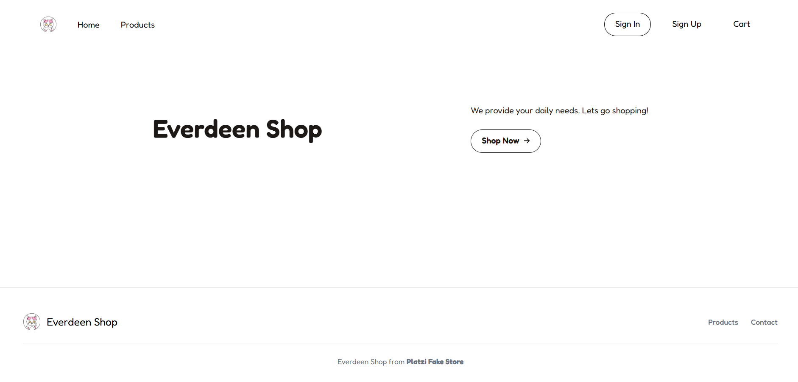

# Everdeen Shop - README

Welcome to **Everdeen Shop**, an e-commerce web application showcasing a wide range of products with the ability to filter by category and add items to your cart.  

Website: [Everdeen Shop](https://everdeenshop.netlify.app/)

---

## Overview of the Application

Everdeen Shop is a modern, user-friendly e-commerce platform designed for users to browse and shop products seamlessly. Built with React, the app dynamically fetches product data from a public API and allows users to filter products by categories, view details, and add items to their cart. 

---

## Features Implemented

- **Dynamic Product List**: Fetch and display products from an external API.
- **Category Filtering**: Filter products based on categories dynamically.
- **Add to Cart**: Seamlessly add products to your cart with one click.
- **Responsive Design**: Optimized for both desktop and mobile devices.
- **Error Handling**: User-friendly error messages in case of API failures.
- **Loading Animation**: Gradient loading screen while data is being fetched.

---

## Installation Instructions

1. **Clone the Repository**:
   ```bash
   git clone https://github.com/your-repo/everdeen-shop.git
   cd everdeen-shop

2. **Install Dependencies: Make sure you have Node.js and npm installed, then run**:
    ```bash
    npm install
    npm start

3. **Open your browser and navigate to http://localhost:3000 to view the application.**

## Technologies Used
- Frontend Framework: React
- CSS: Tailwind CSS for styling
- API: FakeStore API (https://api.escuelajs.co/api/v1)
- Hosting: Netlify
- Screenshots or Demo Links

## Demo:
Everdeen Shop Live Demo [Everdeen Shop](https://everdeenshop.netlify.app/)


## Screenshots:
- Homepage



- Product Categories


- Add to Cart

